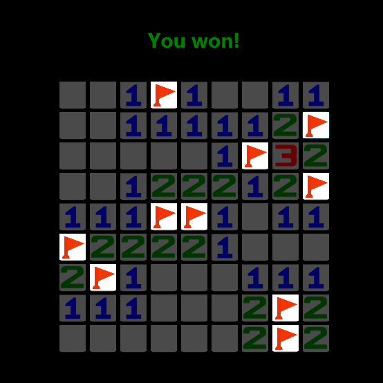

# **Minesweeper - NTUA** 
This project is a variation of the classic game Minesweeper, developed as a project assignment for the course "Multimedia Technology" at ECE NTUA.

## **Games Rules**
In this game, the player must clear a board of hidden mines without detonating any of them. There is also a super-mine and a timer. If the player flags the super-mine within the first 4 tries, all tiles in the same row and column with the super-mine are revealed. If the timer ends before the game is completed, the player loses.

## **Scenarios**
Players can create new scenarios or load existing ones from the `medialab` directory. Scenarios define the game's difficulty, the number of mines, the available time, and whether there is a super-mine.

## **Mines**
Each time a new game is started, the mines are randomly generated in different positions, which can be found in the `mines.txt` file under the `mines` directory. This file also indicates whether a mine is a super-mine or not

## **Rounds**
The game includes a feature that displays information about the last five completed games in a pop-up window. This information includes the following:
1. Total number of mines in the game.
2. Number of attempts made by the player to complete the game.
3. Total game time
4. Winner (player or computer)
 
Information from the last 5 rounds can be found in the `rounds.txt` file under the `rounds` directory.

## **Solution**
The game includes an option to reveal the solution. When this option is activated, all mines are uncovered and the game is counted as a loss.

## **Screenshots**

### Starting Page:
##  

### Win:
## 

### Loss:
## 

### Supermine marking:
## 

### Last 5 Rounds - Info
## 
